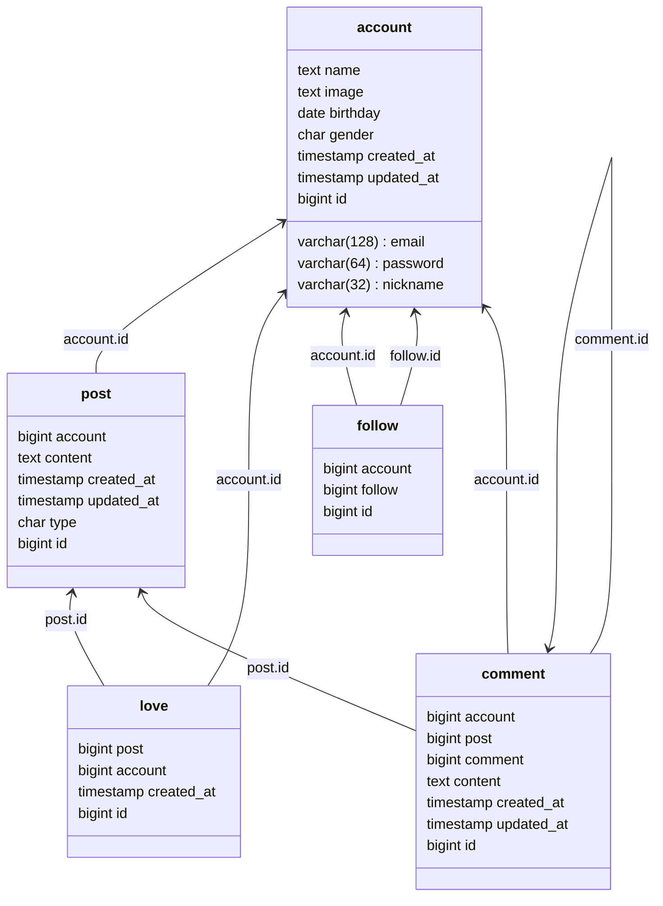

### UML

```mermaid
classDiagram
    direction BT
    class account {
        varchar(128) email
        varchar(64) password
        varchar(32) nickname
        text name
        text image
        date birthday
        char gender
        timestamp created_at
        timestamp updated_at
        bigint id
    }
    class comment {
        bigint account
        bigint post
        bigint comment
        text content
        timestamp created_at
        timestamp updated_at
        bigint id
    }
    class follow {
        bigint account
        bigint follow
        bigint id
    }
    class love {
        bigint post
        bigint account
        timestamp created_at
        bigint id
    }
    class post {
        bigint account
        text content
        timestamp created_at
        timestamp updated_at
        char type
        bigint id
    }

    comment --> account: account.id
    comment --> comment: comment.id
    comment --> post: post.id
    follow --> account: follow.id
    follow --> account: account.id
    love --> account: account.id
    love --> post: post.id
    post --> account: account.id
```
